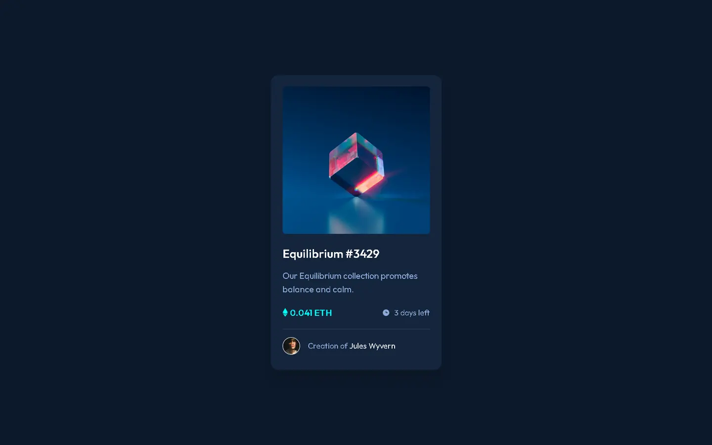

# Frontend Mentor - NFT preview card component solution

This is a solution to the [NFT preview card component challenge on Frontend Mentor](https://www.frontendmentor.io/challenges/nft-preview-card-component-SbdUL_w0U). Frontend Mentor challenges help you improve your coding skills by building realistic projects. 

## Table of contents

- [Overview](#overview)
  - [The challenge](#the-challenge)
  - [Screenshot](#screenshot)
  - [Links](#links)
- [My process](#my-process)
  - [Built with](#built-with)
  - [What I learned](#what-i-learned)
  - [Useful resources](#useful-resources)
- [Author](#author)

## Overview

### The challenge

Users should be able to:

- View the optimal layout depending on their device's screen size
- See hover states for interactive elements

### Screenshot



### Links

- Solution URL: [github](https://github.com/denielden/tailwindcss-nft-preview-card)
- Live Site URL: [live site](https://denielden.github.io/tailwindcss-nft-preview-card/src)

## My process

I have optimized the provided `.jpg` assets using the `.webp` image format.

### Built with

- Semantic HTML5 markup
- CSS custom properties
- Flexbox
- Accessibility first
- Mobile-first workflow
- [Tailwindcss](https://tailwindcss.com/docs/installation) - CSS framework

### What I learned

I learned how to use **tailwindcss**.

For start the Tailwind CLI build process in this project run:
``` npm
npx tailwindcss -i ./src/input.css -o ./src/style.css --watch
```

Tailwind is very convenient but sometimes in the elements that need many classes I find the html too long and confusing.  
What do you think about it?

### Useful resources

- [Tailwindcss](https://tailwindcss.com/docs/installation) - Doc

## Author

- Website - [denielden](https://denielden.github.io)
- Frontend Mentor - [@denielden](https://www.frontendmentor.io/profile/denielden)


## **Have fun building!** 🚀
